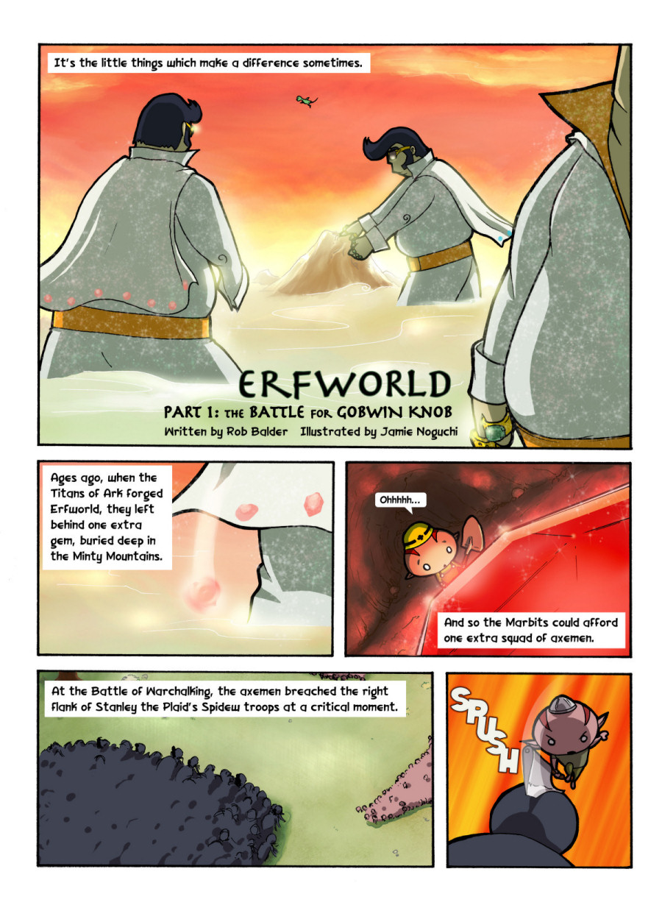
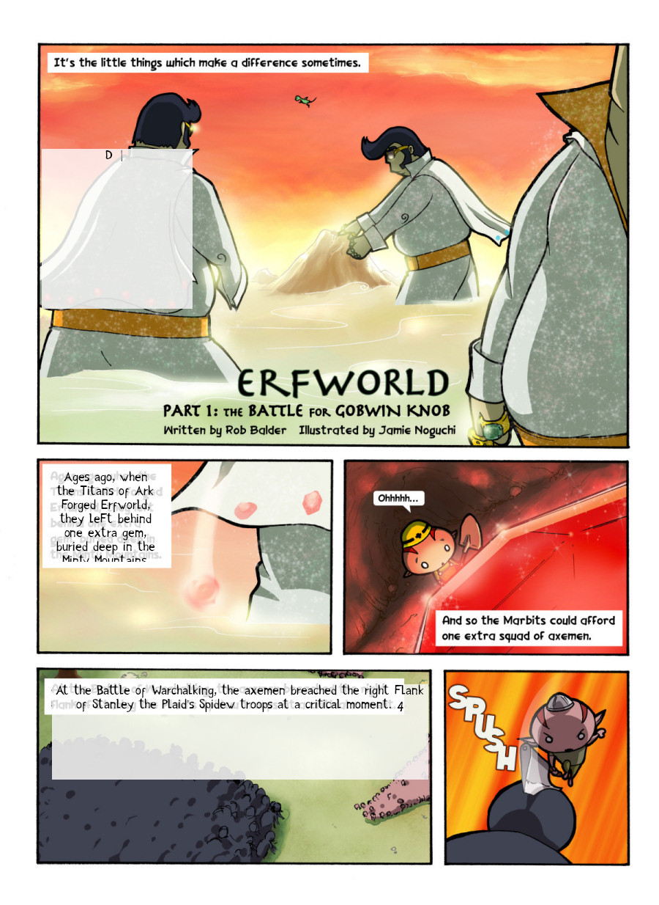
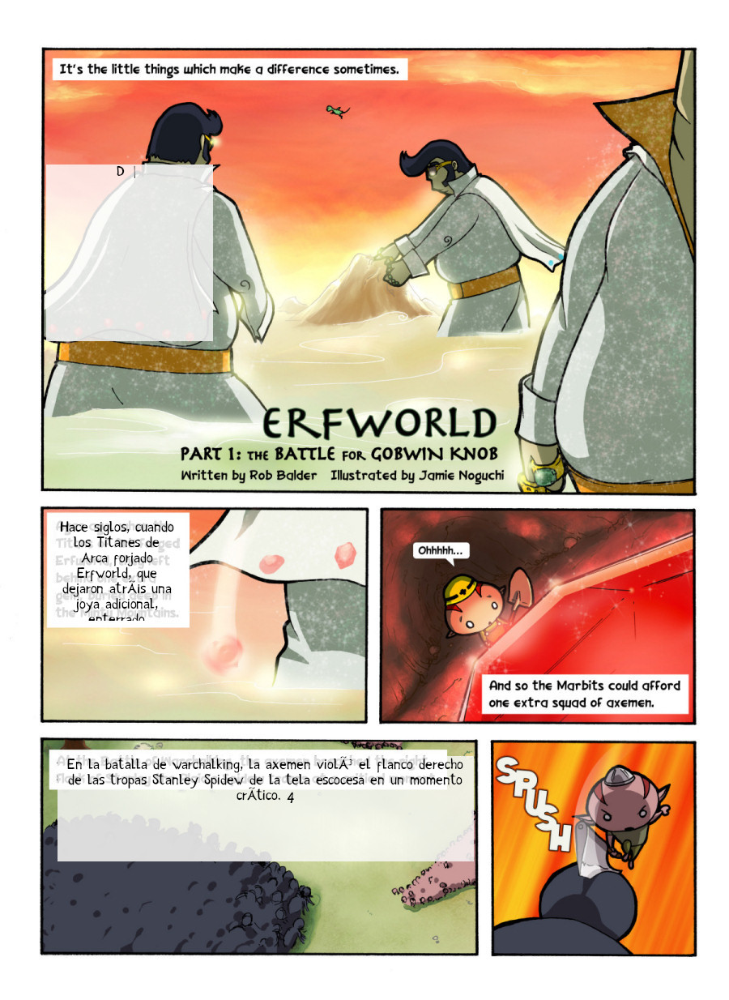

This contains set of utilities for working with images quickly. 

These are generally done using Python via Python-fu in Gimp. The goals of the utilities are:

*  Convert JPG to XCF automatically (probably via script + python bash, or similar): my_script myfile.jpg (done)
*  Add text layer to an approximate location, with an approximate size: `my_script myfile.xcf location text`, where `location` is determined by the numpad, based on quicktile shortcuts and can be series of numbers and text is the required text, e.g. `my_script 11 my text here` would create a box in the bottom left corner, where as `111` will have it cover the bottom left and middle etc.
*  Add text to precise location
*  Adding bubble texts (typically for sound effects)

See here for loading plugins: https://gimplearn.net/viewtopic.php?f=3&t=426&sid=d89513f0a98ca5f339c99eff1dc90758

Running via batch: https://ntcore.com/?p=509

Automated Pipeline Tests
------------------------

We'll use erfworld, which is available via CC as test cases for Tesseract --> text (we'll do with translation separately)

*  https://archives.erfworld.com/

Installation
------------

Only tested on Ubuntu at this stage. Might have missing fonts etc besides requirements.txt (using fonts under OFL only)

```
sudo apt install tesseract-ocr libtesseract-dev
```

Input:



Output:



You can translate using the Google Translate API automatically and overlay it as well



This produces XCF files which can be manually edited

Theres some font issues which need to be solved better. There are Gimp plugins for this, but I feel it doesn't interop with translation files very well. Deal with this better through better scripts (do we prioritise appearance or ability to quickly translate/iterate over work?)